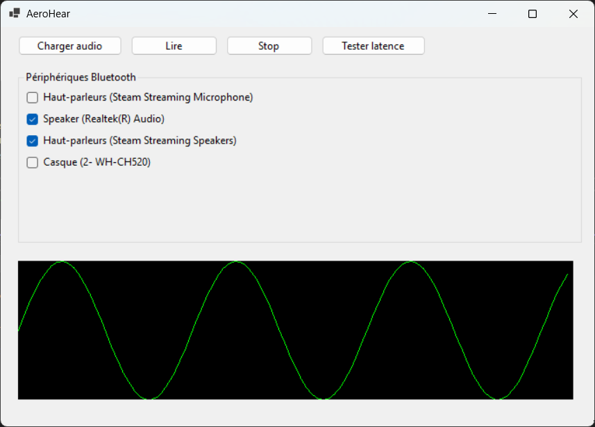

# 🎶 AeroHear

[](https://github.com/AlexandreBobis/AeroHear/releases/latest)

AeroHear est une application qui vous permet de diffuser de la musique **simultanément sur plusieurs appareils Bluetooth**, avec **visualisation audio intégrée**, outils de **synchronisation** et une interface simple à utiliser.

---

## 📸 Capture d’écran



---

## ⚙️ Fonctionnalités

- 🔊 Lecture audio sur plusieurs périphériques Bluetooth
- 🎵 **Intégration Spotify** - Recherchez et jouez vos pistes préférées depuis Spotify
- 🖼️ Visualisation spectrale en temps réel
- ⏱️ Test et réglage de la synchronisation
- 📁 Lecture de fichiers MP3, WAV, FLAC
- 🧩 Interface WinForms simple et portable

---

## 📦 Téléchargement

> ✅ Aucune installation requise — application autonome.

- 📥 [Télécharger l'application (.zip)](https://github.com/AlexandreBobis/AeroHear/releases/latest/download/AeroHear-portable.zip)

---

## 🛠️ Compilation manuelle

### ✅ Prérequis

- [.NET 8 SDK](https://dotnet.microsoft.com/en-us/download)
- Windows 10 ou 11
- Visual Studio 2022 (facultatif, mais recommandé)
- **Compte développeur Spotify** (pour l'intégration Spotify) - voir [SPOTIFY_SETUP.md](SPOTIFY_SETUP.md)

### 🚀 Compilation

```bash
git clone https://github.com/AlexandreBobis/AeroHear.git
cd AeroHear
build.bat
```

Si le build n'a pas fonctionné:

```bash
dotnet publish -c Release -r win-x64 --self-contained true -p:PublishSingleFile=true
```

### 🎵 Configuration Spotify

Pour utiliser l'intégration Spotify, consultez le guide de configuration : [SPOTIFY_SETUP.md](SPOTIFY_SETUP.md)

## 🤝 Contribuer

Les contributions sont les bienvenues !
Signalez un bug ou proposez une fonctionnalité via l’onglet Issues ou ouvrez une Pull Request.

## 📜 Licence

MIT © 2025 — AlexandreBobis